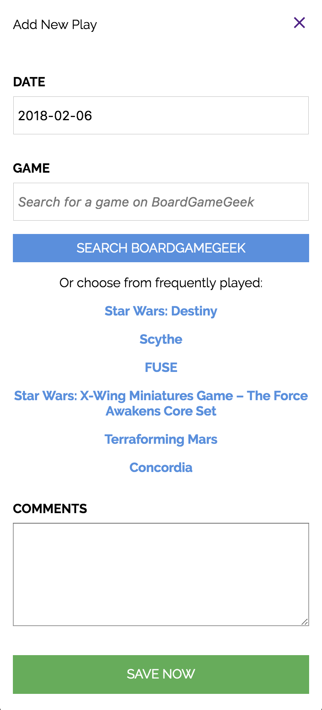

# Board Game Friend
Gamify your games, and log your board game plays!

by Rebecca Jensen

## MOTIVATION
I log my board game plays because I find the stats to be interesting, and I like to see numbers go up. Plus, it's like gamifying games, which is so meta!

I currently track my plays on BoardGameGeek.com, but it's not a very mobile-friendly site and it's missing some features. My goals for Board Game Friend are for users to be able to:

1. Log plays quickly, from mobile or desktop   
2. See interesting stats (it's why we log after all!)  
3. Choose a game to play by filtering and sorting their game collection  

## LINKS
Frontend:  
[Deployed site](https://boardgamefriend.surge.sh)  
[Frontend repo](https://github.com/TalusRocks/boardgametracker-fe)

Backend:   
[Heroku app](https://serene-mesa-27676.herokuapp.com/plays)  
[Backend repo](https://github.com/TalusRocks/boardgametracker-be)  

## SCREENSHOTS
  

